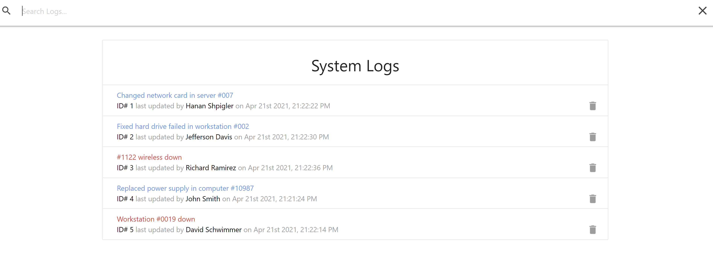
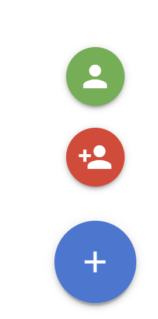
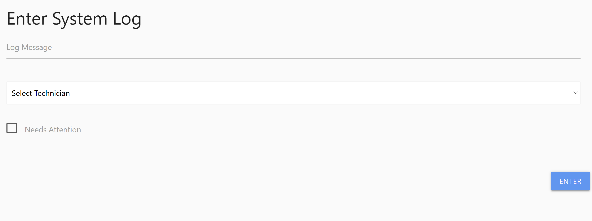

# System Logs
A simple app for managing tasks / fails / reports and much more.

# Instructions
- Download the folder and install dependencies with npm i
- Open the terminal and type npm run dev to run both server and the app.

 ###### 🛍️ Enjoy Shopping Online ! 🛍️ ######
